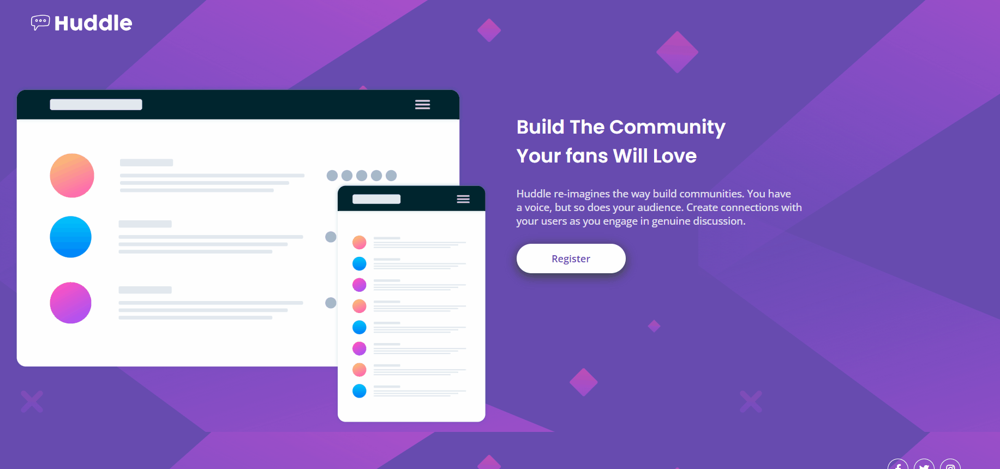
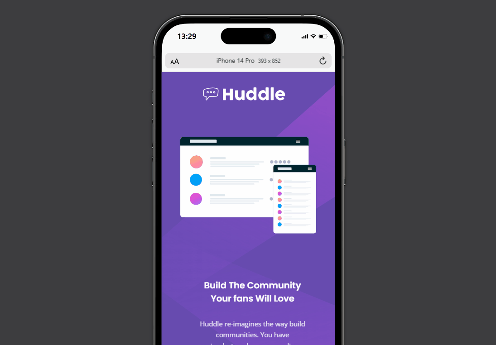

# Quest - Projeto Huddle

Por Gustavo Santos

O projeto foi um desafio do curso Dev Quest extraído do Frontend Mentor e com isso testar nossas habilidades até o momento dentro do curso.

[]

[]

## habilidades requisitadas

Foi pedido que a quest seja realizada com conceitos de FlexBox para eu possa me adequar com a maior parte dos projetos feitos em mundo real de trabalho.

## Desafios encontrados

O projeto de forma geral é simples, usando poucas linhas de código e estilização. Porém até o momento ainda encontrei dificuldades com responsividade, a parte de Media por enquanto é um pequeno desafio, mas com certeza não um problema.

## Novas visões

Até o momento me sinto bem evoluído com o curso. Hoje consigo analisar o projeto que preciso efetuar de forma periférica me ajudando muito mais a começar sem travar nas linhas de código.

## Tecnologias usadas

- HTML
- CSS
